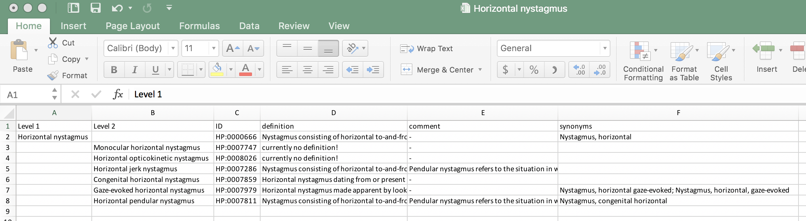
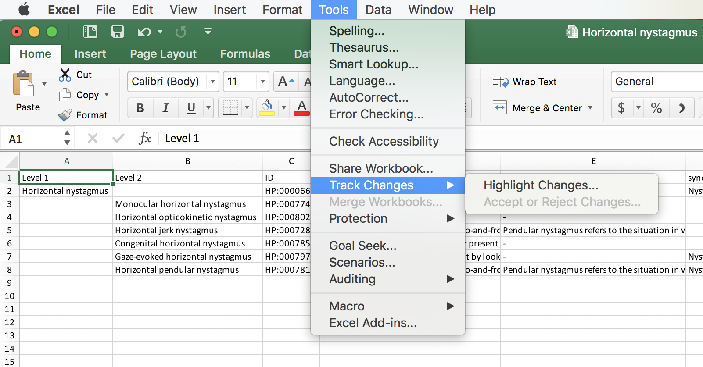
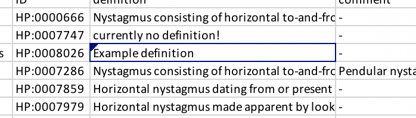

Generating Excel files with HPO Workbench
=========================================
The HPO project welcomes feedback of all kinds, and indeed the high quality of the HPO is a result of
over a decade of interactions with numerous clinicians. If you have a suggestion for one or a few
terms then we would prefer that you use the GitHub functionality. However, if you would prefer not to,
or if you have too many terms to use GitHub, you are also welcome to send us
feedback using the excel files that HPO Workbench exports. Please use the ``Track changes`` function.

Creating Excel files to revise or extend the HPO
~~~~~~~~~~~~~~~~~~~~~~~~~~~~~~~~~~~~~~~~~~~~~~~~

Users who would like to contribute new terms or other information to the
HPO project and who would prefer to use Excel can use HPO Workbench to
create an Excel file to work with. We recommend using the "Create hierarchical summary"
option. To do so, first navigate to the area of the HPO you would like to
work with (e.g., Abnormality of thyroid physiology). Clicking
on the "Create hierarchical summary" button will create an Excel file that
contains only the portion of the hpoOntology that starts from this term.
It will suggest the hierarchy of the hpoOntology by indenting child, grandchild,
great-grandchild (etc) terms in columns located further to the right ("indentation by column").
Please create a new column or columns in this file that will contain your comments
and suggestions. You are welcome to contact the HPO team to
get advice about this before you start (see the HPO Website for email addresses).

We will demonstrate the
feature by exporting a small excel file that represents the HPO hierarchy emanting from the HPO Term
``Horizontal nystagmus``. If you click on the ``Export hierarchical summary`` button, an excel file
will be produced that looks something like the following Figure (we have adjusted the columns widths so that
the entire contents of each column can be easily seen).

We see that ``Horizontal nystagmus`` is shown as having level 1, and its child terms (e.g., ``Horizontal jerk nystagmus``)
are shown as having the next lower level (level 2). The definitions, comments, and synonyms of these terms can be seen
in additional columns.

Using the Track Changes feature in Excel
~~~~~~~~~~~~~~~~~~~~~~~~~~~~~~~~~~~~~~~~
Many people are familiar with the Track Changes feature in Word, which shows changes to a document
by coloring or otherwise highlighting changes (depending on the Word version and the user settings). Excel
also has this feature, but the changes are not marked in quite such an obvious way. To activate the feature,
go to the Tools menu and select ``Track changes|Highlight changes...``.
In the dialog that opens after you select this item, put a check mark in the box for ``Track changes while editing`` and
apply the tracking to All changes.

We see that the term ``Horizontal opticokinetic nystagmus`` currently has no definition. To demonstrate the track changes feature,
we will add the text "Example definition" to the corresponding cell of the Excel file. The figure shows that there is
now a black triangle at the upper left corner of the cell that we changed. Please make sure that all of your changes
are marked in this way.

If you have more comments or suggestions, please create one or more columns to hold the information you would like
to enter. Add your columns directly after the final column produced by HPO Workbench. When you are finished, please
send the file to the HPO team. It is highly recommended to contact the HPO team before beginning to work with
Excel files for biocuration. We would be glad to check your work for one or two terms in order to ensure that
all information is being faithfully transmitte4d in the Excel file before you do a lot of work. If you do not know
who to contact, please consult the Team page of the Hpo Website at https://www.human-phenotype-hpoOntology.org.