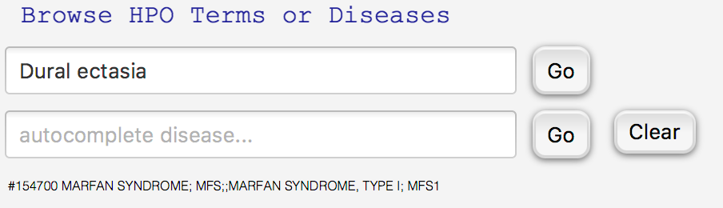

Using GitHub from  HPO Workbench
================================
GitHub is widely used by developers to manage projects together with versioning, bug reports and other issues, and
many other features. We use it to host the main HPO file, and we use the GitHub issue tracker to manage suggestions.
Users can post a new issue and suggest a new term or revisions to existing terms. If we have a question, we will
post it as a comment to a GitHub issue (in this case, you will receive an email with the text of the question and
can respond to it by email or by visiting the corresponding GitHub page. To use this functionality, you will need
to register a GitHub name and password (which is free and easy to see up; see https://github.com). If you choose
not to use GitHub, another way of sending us feedback is by exporting an excel file and writing your comments in this
file (see the next page of this documentation).

Creating GitHub issues
~~~~~~~~~~~~~~~~~~~~~~

Users can create an issue with a suggestion for an existing term by navigating to a term they would like to
comment on and clicking on the create suggestion button. Users will need to enter their GitHub username
and password (which will be stored for the duration of the session, so that multiple issues can be created
without having to reenter the GitHub username and password multiple times.
If users would like to suggest a new term, navigate to the proposed parent of the new term, and click on
suggest child term.

A dialog will appear with information about the term selected by the user. Enter your suggestion in the
text field. Then, enter your GitHub username and password, and  and click on *Create github issue*. HPO
Workbench will store the username and password for the duration of the session so they only need to be
entered once. The data is not written to disk.

.. figure:: img/GitHubNewIssue.png
  :scale: 40 %
  :align: center
  :alt: HPO Workbench - new issue

Suggesting new annotations
~~~~~~~~~~~~~~~~~~~~~~~~~~

First navigate to a disease of interest as above. This will cause the name of the disease to be
shown right underneath the search window. This is now the current disease. Following this,
search for the desired new annotation (HPO term) using the autocomplete field or ontology
hierarchy.

We can now click on the ``Suggest new annotation`` button
(which turns color, acquiring a blue hue to show it was clicked).
This opens up a dialog that suggests that the HPO Term
For real requests of this sort it would be
very much appreciated it you can indicate the source of the annotation (the best source is an article in PubMed - please provide
the PubMed id and the title). If possible, also indicate other attributes of the annotation. What is the age of onset?
What is the overall frequency of patients with the disease that have the phenotypic abnormality in question (enter 5/8, for
instance, of 5 or 8 patients described in a publication were found to have the feature, but the feature was ruled out in the
other 3).

