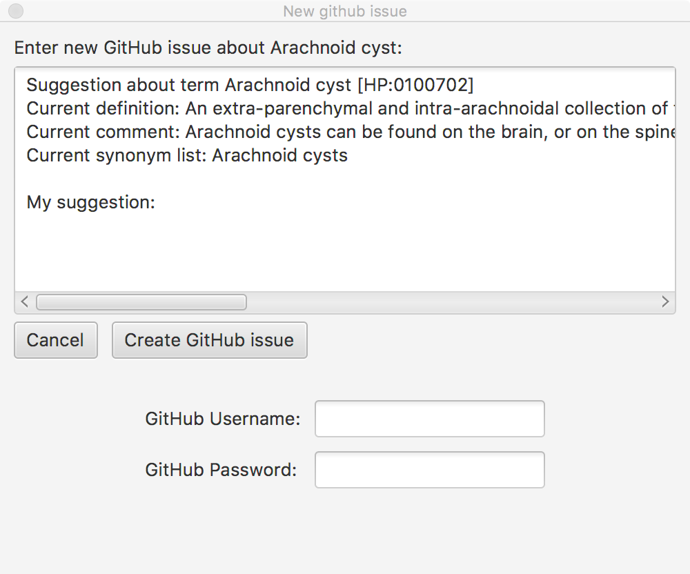
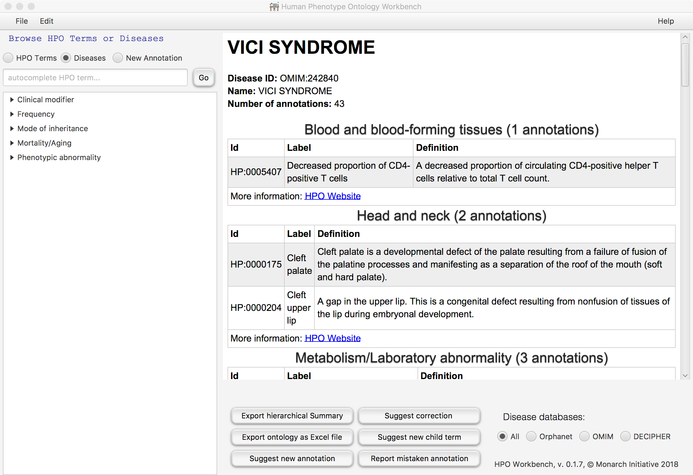

Using HPO Workbench
=====================================
Navigate through the hierarchy of the using the tree browser or
use the autocomplete text field to find the HPO term of your choice.
HPO Workbench will display the ID, definition, comment, and synyonyms
for the term. If any diseases in the HPO corpus are annotated to
the term, a list of the diseases will be displayed.

Creating Excel files to revise or extend the HPO
~~~~~~~~~~~~~~~~~~~~~~~~~~~~~~~~~~~~~~~~~~~~~~~~

Users who would like to contribute new terms or other information to the
HPO project and who would prefer to use Excel can use HPO Workbench to
create an Excel file to work with. We recommend using the "Create hierarchical summary"
option. To do so, first navigate to the area of the HPO you would like to
work with (e.g., Abnormality of thyroid physiology). Clicking
on the "Create hierarchical summary" button will create an Excel file that
contains only the portion of the ontology that starts from this term.
It will suggest the hierarchy of the ontology by indenting child, grandchild,
great-grandchild (etc) terms in columns located further to the right ("indentation by column").
Please create a new column or columns in this file that will contain your comments
and suggestions. You are welcome to contact the HPO team to
get advice about this before you start (see the HPO Website for email addresses).

Creating GitHub issues
~~~~~~~~~~~~~~~~~~~~~~

Users can create an issue with a suggestion for an existing term by navigating to a term they would like to
comment on and clicking on the create suggestion button. Users will need to enter their GitHub username
and password (which will be stored for the duration of the session, so that multiple issues can be created
without having to reenter the GitHub username and password multiple times.
If users would like to suggest a new term, navigate to the proposed parent of the new term, and click on
suggest child term.

A dialog will appear with information about the term selected by the user. Enter your suggestion in the
text field. Then, enter your GitHub username and password, and  and click on *Create github issue*. HPO
Workbench will store the username and password for the duration of the session so they only need to be
entered once. The data is not written to disk.

Viewing annotated diseases
~~~~~~~~~~~~~~~~~~~~~~~~~~

The diseases annotated to a given HPO term (including direct and implied annotations) can be viewed in the
browser. If desired, users can limit the diseases to one of the databases, Orphanet, OMIM, or DECIPHER.
To find the disease of interest, choose the radio button *diseases* and use the autocomplete field
to find the disease, and click on the GO button.

Suggesting new annotations
~~~~~~~~~~~~~~~~~~~~~~~~~~

First navigate to a disease of interest as above. Then, click on the *New annotation* radio button. Then
use the autocomplete field or the HPO ontology hierarchy on the left to find the term you would like to
propose as a new annotation for the disease. Then, click on the *Suggest new annotation* button to
open a new GitHub issue as above. Again, please modify the text to provide information to support the suggestion.
Use the *Report mistaken annotation* if you have found an error in the annotations for some disease.

Command line
~~~~~~~~~~~~

Some of the functionality is also available in the command line (cli) module
and may be useful for scripting.

